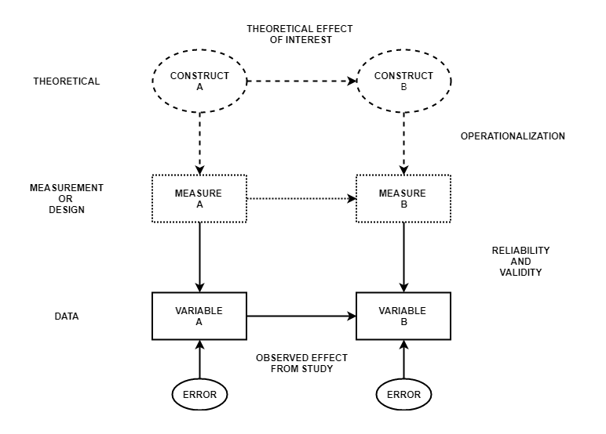
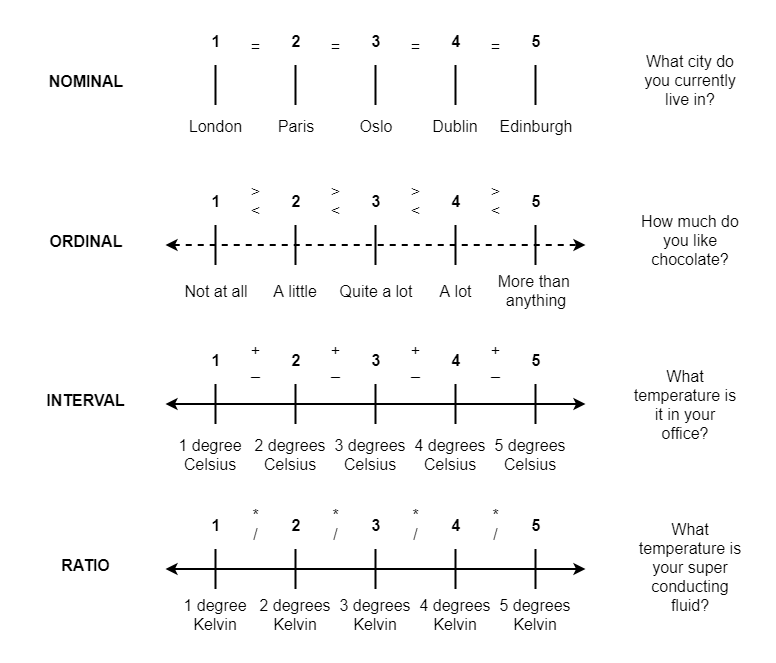
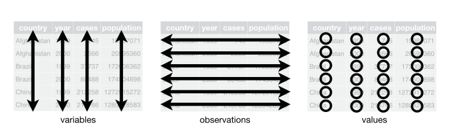

```{r setup, include=FALSE}
options(htmltools.dir.version = FALSE)
```

```{r xaringan-themer, include = FALSE}
library(xaringanthemer)
style_mono_accent(
    base_color = "#0F4C81", # DAPR1
  # base_color = "#BF1932", # DAPR2
  # base_color = "#88B04B", # DAPR3 
  # base_color = "#FCBB06", # USMR
  # base_color = "#a41ae4", # MSMR
  header_color = "#000000",
  header_font_google = google_font("Source Sans Pro"),
  header_font_weight = 400,
  text_font_google = google_font("Source Sans Pro", "400", "400i", "600", "600i"),
  code_font_google = google_font("Source Code Pro")
)

library(tidyverse)
library(kableExtra)
```

# Week's Learning Objectives
1. Understand the link between study design and data.

2. Understand and define different levels of measurement.

3. Understand and define data types with psychological examples.

---
# Topics for today
+ Broad aim of measurement

+ Measurement, design, and data

+ Data in R

---
#  Concepts in measurement

```{r, echo=FALSE, out.width="60%"}

```

???
- When we ask research questions, we ask about phenomena.
	- But we cant answer these questions unless we measure the phenomena/construct
- Figure: 
  - stuff in the world with some relation; 
  - you operationalise by creating a measure of; 
  - using the measure produces an oucome (which we'll call a variable), and that outcome is reflective of the actual construct in the world to some degree (validity) and measures the extent of that construct consistently (reliability) 
- Measurement is a huge philosophical topic in psychology, which we will not attempt to broach in detail. 
- However, a few concepts are useful.


---
# Data types & levels

.pull-left[
+ *Categorical*
    + Nominal
    + Ordinal
    + Binary (special case)
]

.pull-right[
+ *Numeric*
    + Interval or ratio
    + Continuous
    + Discrete (Count)
]


???
+ There are a huge amount of ways we can measure things.
  + and our measurement gives rise to data. 
  + (this course would be very short if we did not have data)
+ Dependent on our measurement choices, data can look quite different.
  + And have different properties.
+ There exist a few different schemes for characterising data.


---
#  Types of data
+ **Categorical:** Variables with a *discrete* number of response options.
  + These are usually coded as integers.
	+ Binary data is a special case with only 2 possible values.

---
#  Types of data
```{r echo = FALSE}
examples <- tibble(
  ID = c(paste("ID", c(101:105), sep = "")),
  Hair_colour = as_factor(c("Brown", "Brown", "Blonde", "Blonde", "Black")),
  Hair_values = c(1, 1, 2, 2, 3),
  Likert_item = as_factor(c("Strongly Agree", "Agree", "Agree", "Disagree", "Strongly Disagree")),
  Likert_values = c(5,4,4,2,1),
  Degree = as_factor(c("No", "No", "Yes", "Yes", "Yes")),
  Degree_values = c(0,0,1,1,1),
  ReactionTime = c(1.2, 0.9, 3.2, 55.5, 2.1),
  Height_cm = c(191.2, 180.8, 165.3, 177.1, 201.0),
  Weight_kg = c(88.9, 76.6, 52.0, 81.5, 105.8),
  IQ = c(100, 105, 99, 120, 131)
)
```

```{r echo=FALSE}
kable(examples[,c(1, 2, 4, 6)]) %>%
  kable_styling(bootstrap_options = "striped", full_width = F)
```

+ Example: Hair colour, Likert Scale items, Degree or Not?

---
#  Types of data
+ **Categorical:** Variables with a *discrete* number of response options.
	+ Binary data is a special case with only 2 possible values.

+ **Numeric:** (continuous) Variables which can take any real number value within the specified range of measurement.

---
#  Types of data

```{r echo=FALSE}
kable(examples[,c(1, 8:10)]) %>%
  kable_styling(bootstrap_options = "striped", full_width = F)
```

+ Examples: Height in cm; Weight in kg; Reaction time

---
# Types of data 
- **Categorical**: Variables with a discrete number of response options.
    - Binary data is a special case with only 2 possible values.

- **Numeric**: Variables which can take any real number value within the specified range of measurement.

- **Count**: Variables which can only take non-negative integer values (0,1,2,3 etc.).

---
#  Levels of measurement 
+ Terms coined by Stevens (1946), and we are still using them!

+ 4 levels are general discussed (though also critiqued - see additional reading):

--

	+ Nominal
	+ Ordinal
	+ Interval
	+ Ratio

--

+ With each level, the numeric values we apply hold different meanings, and we are able to do more with the values.

???
- That is to say, with different levels of measurement, the numbers produced mean different things and lend themselves to different operations. 
- Generally, as we move down the levels, there is more we can do with the numbers. 


---
# Nominal data

.pull-left[
+ Binary or categorical variable where numerical markers share no relationship.
+ Here is no meaningful ordering.
]


.pull-right[
```{r echo=FALSE}
kable(examples[,c(1:3)]) %>%
  kable_styling(bootstrap_options = "striped", full_width = F)
```

+ Example: Hair colour
  + 1 = Brown, 2 = Blonde, 3 = Black
]

---
# Ordinal data

.pull-left[
+ Binary or categorical variable where there exists a meaningful way to **rank-order** responses.

+ Here X < Y or Y > X statements can be made, but we can not meaningfully quantify the differences.
]


.pull-right[
```{r echo=FALSE}
kable(examples[,c(1,4:5)]) %>%
  kable_styling(bootstrap_options = "striped", full_width = F)
```

+ Example: Likert scale items
  + 1 = Strongly Disagree, 2 = Disagree, 3 = Neither A/D, 4 = Agree, 5 = Strongly Agree
]


---
# Interval & Ratio

.pull-left[
**Interval data**

+ Variables for which numerical values have meaning.

+ There is no true 0 point on an interval scale.
  + But we can consider differences.
  + And the differences have a true 0 point.

+ Now it gets harder to talk about psychological examples.
  + Some would consider IQ and other test scores as interval.
]

.pull-right[
**Ratio data**

+ Variables for which numerical values have meaning.

+ Variables have a true 0 point.
  + As a result, it is plausible to multiply and divide ratio variables.
  + We can legitimately talk about double X

+ Some examples might be reaction time, or the firing rate of a neuron.
]

---
# Levels of measurement
```{r, echo=FALSE, out.width="50%"}

```


---
# Data types and R


| R Data Type    | Example           | Level of Measurement | Data Type     |
|----------------|-------------------|----------------------|---------------|
| Character      | ID                | Nominal              | (Categorical) |
| Numeric        | Reaction Time     | Interval or ratio    | Continuous    | 
| Factor         | Hair Colour       | Nominal              | Categorical   |
| Ordered factor | Likert scale      | Ordinal              | Categorical   |


---
# Data and data sets

```{r, echo=FALSE, out.width="60%"}

```


???
+ Look back at our summary diagram.
+ Note our data (bottom section) has multiple variables
+ Typically many more than 2 in any study
+ Multiple variables are stored in data sets

---
# Data sets
```{r, echo=FALSE, out.width="50%"}

```

???
+ If you have ever entered numbers into a spreadsheet, then you have worked with a data set
+ Though we will add new language, you will have used data sets in principle before
+ One of the key things that differentiates how we will think about data is the idea of it being **tidy**

---
# Tidy data
1. Each variable must have its own column.

2. Each observation must have its own row.

3. Each value must have its own cell.

+ This means that each individual value belongs to both a variable and an observation.


---
# Things we need to do with data sets
+ We will be constantly practising dealing with data and data sets. 

+ But there is a common set of things we have to do:

--
  
  + Import them into R
    + We will refer to them as data frame, data sets or tibbles

--

  + Check each variable is of the right type
  
--

  + Select columns
  
--

  + Filter rows

--

  + Recode variables

--

  + Create variables or summaries

--

  + Merge data sets together

-- 

  + And so on... 


---
# Summary of today

+ Today we have looked at the links between design and data.

+ Discussed basic types of data, their properties, and the names in R.

+ And briefly define what is meant by data sets and tidy data.

+ All of this we will be returning to over the duration of the course.

---
# Next tasks
+ Next week we will begin looking at describing data.

+ This week:
  + Complete your lab
  + Come to office hours
  + Complete the practice quiz.
  
