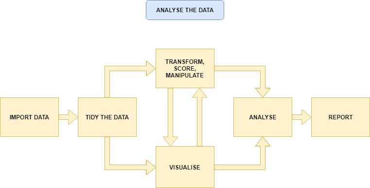

```{r setup, include=FALSE}
options(htmltools.dir.version = FALSE)
```

```{r xaringan-themer, include = FALSE}
library(xaringanthemer)
style_mono_accent(
    base_color = "#0F4C81", # DAPR1
  # base_color = "#BF1932", # DAPR2
  # base_color = "#88B04B", # DAPR3 
  # base_color = "#FCBB06", # USMR
  # base_color = "#a41ae4", # MSMR
  header_color = "#000000",
  header_font_google = google_font("Source Sans Pro"),
  header_font_weight = 400,
  text_font_google = google_font("Source Sans Pro", "400", "400i", "600", "600i"),
  code_font_google = google_font("Source Code Pro")
)

library(tidyverse)
library(kableExtra)

```

# Weeks Learning Objectives
1. Understand the different quantities used to describe the distributions of data.

2. Understand the appropriate visualization for the distribution of categorical data.

3. Understand methods to calculate the spread for the distribution of categorical data.

4. Understand methods to calculate central tendency for the distribution of categorical data.

---
# Topics for today
+ Last week we looked at definitions of different types of data.

+ Now we are going to move on to how we describe different types of data.

+ First, we will look at categorical variables.

---
class: center, middle

```{r, echo=FALSE, out.width= "70%"}

```

???
+Make point that the next 3 weeks are looking at the middle section, whilst practicing the first two
+ To visualize, we need to introduce the concept of the frequency distribution

---
# Recap: Categorical data

+ Nominal
  + No order to the levels of the variable
  + E.g. "Country of residence", "Degree Studied"
      + 1 = Psychology
      + 2 = Philosophy
      + 3 = English Language
  + We can give each response a numerical value, but convey no meaning beyond group membership
  
--

+ Ordinal
  + Numerical values denote order.
  + E.g. "Level of Education"
      + 1 = GCSE
      + 2 = A-level
      + 3 = University undergraduate degree
      + 4 = University postgraduate degree

---
# Frequency Distribution

> **"a mathematical function showing the number of instances in which a variable takes each of its possible values."**

+ Or put simply

> **A plot showing the number of instances of each value of a variable**

---
# An example

.pull-left[

+ I toss a coin 10 times 

+ I plot the number of instances of head and tails.

]

.pull-right[
```{r, echo=FALSE}
set.seed(1066)
df <- tibble(
    dat = factor(rbinom(10, 1, 0.5))
)
bp <- df %>%
    ggplot(., aes(x=dat)) +
    geom_bar(fill="steelblue4") +
    labs(x = "Coin toss result", y = "Count") +
    scale_x_discrete(labels = c("Heads", "Tails"))


bp
```
]


---
# Plotting fundamentals 

.pull-left[

+ There are many types of graph, all of which are intended to summarise different types of data, or the relations between data.

+ We are going to spend a lot of time dealing with plots this semester.

+ Let's pause for a moment and consider the basic structure
]

.pull-right[
```{r, echo=FALSE}
bp
```
]


---
# Plotting fundamentals 

.pull-left[

+ Data

+ Axes 
  + (aesthetics in `ggplot` language - also includes size, colours etc.)

+ Axes have scales

+ Geometric objects 
  + (`geoms` in `ggplot` language; i.e. bars, points, lines)
]

.pull-right[
```{r, echo=FALSE}
bp
```
]


---
# Bar plot

.pull-left[

+ Bar plots are used to show frequency distributions of categorical variables.

+ Our example:
  + **Data** = result of our 10 coin tosses.
  
  + **X-axis**: values of variable (here "Heads" or "Tails)
      + Scale = two discrete values
  
  + **Y-axis**: Frequency
      + Scale = count 
]

.pull-right[
```{r, echo=FALSE}
bp
```
]


---
# Bar plot

.pull-left[

```{r, eval=FALSE}
df %>%
    ggplot(., aes(x=dat)) +
    geom_bar(fill="steelblue4") +
    labs(x = "Coin toss result", y = "Count") +
    scale_x_discrete(labels = c("Heads", "Tails"))
```

+ `df` = data set
+ `aes(x=dat)` = the variable `dat` is used on x-axis
+ `geom_bar()` = make a bar plot
  + `fill="steelblue4"` = make the bars blue
+ `labs` = what to label each axis
+ `scale_x_discrete` = what to label to tick marks on the x-axis

]

.pull-right[
```{r, echo=FALSE}
bp
```
]


---
# A more realistic example

.pull-left[
+ Suppose I am running a stats summer school.

+ It is open to all students in PPLS
  + All degrees
  + All years
  
+ I gather data on all 150 attendees.
  + `ID` = unique identifier
  + `Degree` = degree studied
  + `Year` = year of study
  + `Score1` = pre-summer school score
  + `Score2` = post-summer school score 
  
+ Let's describe `Degree` and `Year`
]


.pull-right[

**Data from 10 participants**

```{r, echo=FALSE}
ex1 <- read_csv("./ex1.csv", col_types = "cfddd")
kable(ex1[1:10,])
```


]

---
# Bar plot for `Degree`

.pull-left[

```{r, eval=FALSE}
ex1 %>%
    ggplot(., aes(x=Degree)) +
    geom_bar(fill="steelblue4") +
    labs(x = "Degree Subject", y = "Count")
```


]

.pull-right[
```{r, echo=FALSE}
ex1 %>%
    ggplot(., aes(x=Degree)) +
    geom_bar(fill="steelblue4") +
    labs(x = "\n Degree Subject", y = "Count \n")
```
]


???
How do I describe this with numbers?


---
# Describing distributions
+ We typically want to know something about the:
  + central point, and
  + the spread (or dispersion around centre point)

--

+ **Central tendency**
  + a set of statistics that describe the central point of frequency distributions.
  + typically referred to as "averages"
      + But this can have many meanings.

--

+ **Dispersion**
  + a set of statistics that descibe the variation in frequency distributions


---
# Categorical Data

+ Nominal

--

  + Central tendency = Mode
  + Variability = Relative frequency

--

+ Ordinal

--

  + Central tendency = mode or median
  + Variability = Range, inter-quartile range
  
  
---
# Frequency Table: Degree

.pull-left[

+ A frequency table shows:
  + Possible outcomes
  + Count of the number of observations per outcome
  + We can also add the count as a percentage


+ The code:
  + `count` provides the frequency of each value
  + `mutate` is used to calculate new variables
  + `round(n/sum(n)*100,2)`
      + take the column created by `count`, `n`, 
      + divide each value by the sum of counts (=sample size)
      + *100 to turn to a percent

]

.pull-right[
```{r}
ex1 %>%
  count(Degree) %>%
  mutate(
    Percent = round((n/sum(n))*100,2)
  )
```

]


---
#  Mode: Degree 

.pull-left[
> **Mode**: The most commonly observed value in the data set.

+ It is of course possible that we observe two (or more) values with equal frequency.

+ We then have a **multi-modal** distribution.

]

.pull-right[
```{r, echo=FALSE}
ex1 %>%
    ggplot(., aes(x=Degree)) +
    geom_bar(fill="steelblue4") +
    labs(x = "\n Degree Subject", y = "Count \n")
```

]


---
#  Mode: Degree 

.pull-left[
> **Mode**: The most commonly observed value in the data set.

+ It is of course possible that we observe two (or more) values with equal frequency.

+ We then have a **multi-modal** distribution.
]

.pull-right[
```{r}
ex1 %>%
  count(Degree)
```

]


---
# Bar plot for `Year`

.pull-left[
```{r, eval=FALSE}
ex1 %>%
    ggplot(., aes(x=Year)) +
    geom_bar(fill="steelblue4") +
    labs(x = "\n Degree Year", 
         y = "Count \n")
```

]

.pull-right[
```{r, echo=FALSE}
ex1 %>%
    ggplot(., aes(x=Year)) +
    geom_bar(fill="steelblue4") +
    labs(x = "\n Degree Year", y = "Count \n")
```

]


---
# Median: `Year`

> **Median:** is the value for which half the data falls above, and half below the given value.

+ To calculate the median:
  + Rank order the data.
  + Find the middle value.

+ The position of the median is given by:

$$median = \frac{n+1}{2}$$

+ For an odd number of data points, this will equal a whole number.

+ For an even number of data points, this will equal a mid-point between two values.
  + e.g. 5.5 would indicate the median is between the 5th and 6th position.
  + The median is then equal to the average of these numbers.

---
# Calculating median: Small example

.pull-left[

**Odd number of elements**
$$
\begin{bmatrix}
3 \\ 
1 \\ 
6 \\
10 \\
5 \\ 
\end{bmatrix}
$$

**Rank order**

$$
\begin{bmatrix}
1 \\ 
3 \\ 
5 \\
6 \\
10 \\ 
\end{bmatrix}
$$

]

.pull-right[

**Calculate position of median**

$$median = \frac{n+1}{2} = \frac{5+1}{2} = 3$$


**Apply to ordered data**

+ The third value in the ordered vector = 5

]


---
# Calculating median: Small example

.pull-left[

**Even number of elements**
$$
\begin{bmatrix}
3 \\ 
1 \\ 
6 \\
10 \\
5 \\
8 \\
\end{bmatrix}
$$

**Rank order**

$$
\begin{bmatrix}
1 \\ 
3 \\ 
5 \\
6 \\
8 \\
10 \\ 
\end{bmatrix}
$$

]

.pull-right[

**Calculate position of median**

$$median = \frac{n+1}{2} = \frac{6+1}{2} = 3.5$$


**Apply to ordered data**

+ The 3rd value = 5

+ The 4th value = 6


**Average**

$$\frac{5+6}{2} = 5.5$$
]

---
# Median: Year

.pull-left[

+ For small examples, hand calculation is fine.

+ But we have 150 data points!

+ Thank goodness for computers and `R`

]


.pull-right[

```{r}
median(ex1$Year)
```


]

---
# Range: Year

.pull-left[
+ The **range** of the data is simply the value between two points.
  + We can define these points in different ways.

+ Simplest is the total range in the data (maximum - minimum).
]

.pull-right[
```{r}
min(ex1$Year)
```

```{r}
max(ex1$Year)
```

```{r}
range(ex1$Year)
```

]


---
# Inter-quartile range: Year
+ The **inter-quartile range (IQR)** is the difference between the 1st and 3rd quartile.
  + Rank the data
  + Split data into four equal blocks.
  + Quartiles are the points which divide these blocks.
  + They fall at 25%, 50% and 75% of rank ordered data.
  + IQR is the difference between 25% and 75%

--

+ For ordinal data:
  + The first quartile is the first category for which the cumulative percentage is $\geq 25\%$.  
  + The median is the first category for which the cumulative percentage is $\geq 50\%$.  
  + The fourth quartile is the first category for which the cumulative percentage is $\geq 75\%$.


---
# What is cumulative percentage?

+ Remember our percentage calculations?

+ Well, imagine stacking these on top of one another...

```{r}
ex1 %>%
  count(Degree) %>%
  mutate(
    Percent = round((n/sum(n))*100,2),
    Cumulative = cumsum(Percent) #<<
  )
```

+ More on this in labs.


---
# Inter-quartile range: Year

.pull-left[
+ We can calculate the IQR directly using the function `IQR()`

+ Or calculate various quantiles using the `quantile()` function
]


.pull-right[

```{r}
quantile(ex1$Year, c(.25, .75))
```

+ So the 25th percentile = 2, and the 75th = 3

+ So the inter-quartile range is....

```{r}
IQR(ex1$Year)
```

]

---
# Ranks and order
+ Notice how both the median and the IQR make use of ranked data.

+ Ranked = ordered.

+ Hence use with ordinal data.

---
# Summary of today
+ Phew, time for a breather!

+ To describe nominal data we use
  + Bar plots
  + Mode
  + Frequency tables

+ To describe ordinal data we use:
  + Bar plots
  + Mode or median
  + Range (total, IQR)

---
# Next tasks
+ Next week, we will look at describing continuous variables.

+ This week:
  + Complete your lab
  + Come to office hours
  + Complete handbook quiz.
      + Open Monday 09:00
      + Closes Sunday 17:00
