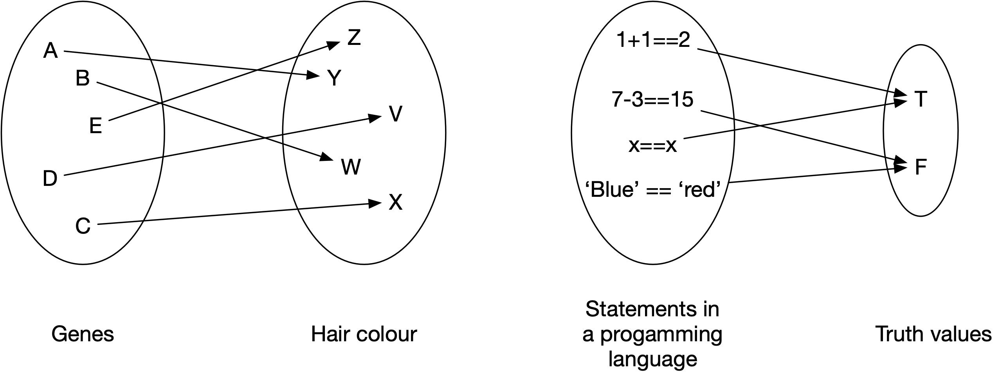
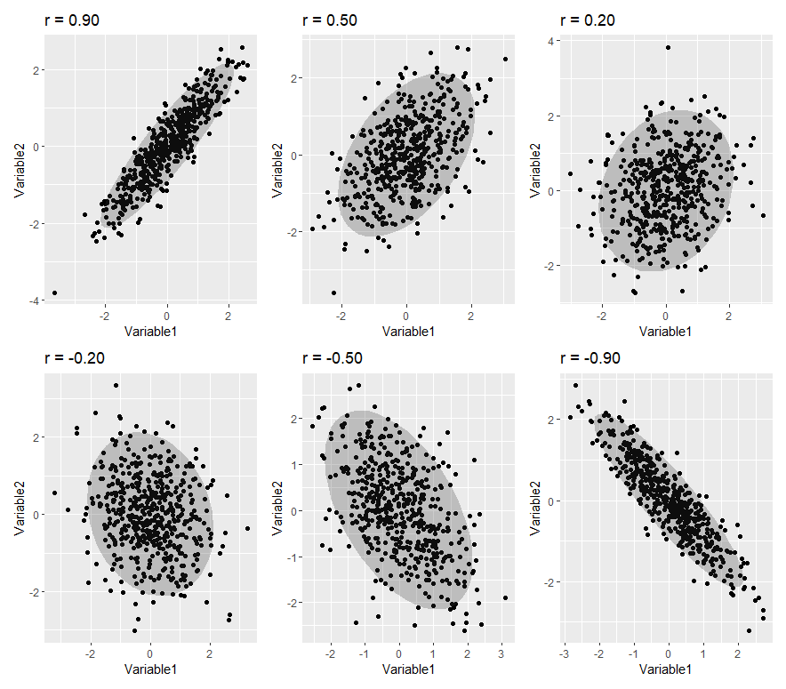

```{r setup, include=FALSE}
options(htmltools.dir.version = FALSE)
```

```{r xaringan-themer, include = FALSE, warning=FALSE}
library(xaringanthemer)
style_mono_accent(
    base_color = "#0F4C81", # DAPR1
  # base_color = "#BF1932", # DAPR2
  # base_color = "#88B04B", # DAPR3 
  # base_color = "#FCBB06", # USMR
  # base_color = "#a41ae4", # MSMR
  header_color = "#000000",
  header_font_google = google_font("Source Sans Pro"),
  header_font_weight = 400,
  text_font_google = google_font("Source Sans Pro", "400", "400i", "600", "600i"),
  code_font_google = google_font("Source Code Pro")
)

library(tidyverse)
library(kableExtra)
library(patchwork)
library(ggmosaic)
```

# Weeks Learning Objectives
1. Understand the relation between X-Y (explanatory/outcome) specification and practical research questions.

2. Understand how to summarise and visualize categorical-categorical relationships.

3. Understand how to summarise and visualize numeric-categorical relationships.

4. Understand how to summarise and visualize numeric-numeric relationships.

---
# Topics for today
+ We have looked at how to describe individual variables.

  + Recall: A variable is a symbol specifying a value that may change or that we don't know yet. 

+ But we also need to describe the relationships between variables.

+ These relationships are also the core of the statistical models we are going to move on to discuss.

+ Today we will look at basic descriptions.


---
# What is a relationship?
+ A connection between two or more entities. 

--

+ In science, a connection between two things (or a relation between two things) is defined as a mapping between the elements of those two things. 

```{r, echo=FALSE, out.width="75%"}

```

--

+ Aside: We will usually prefer to define the relationship using a function (we'll go over what those are next lecture...)

---
# Why are relationships important?
+ We typically have theories about relationships or predictions between variables.

+ Our study designs distinguish between:

--

+ **Dependent variables**: The thing we want to predict/understand.
  + Also referred to as the outcome.
  + or as $y$ in stats notation

--

+ **Independent variables**: The things we hypothesize influence the DV.
  + Also referred to as the predictor, explanatory variable.
  + or as $x$ in stats notation

--

+ **Covariates**: Things that will influence the outcome, but we may not have a hypothesis about.
  + Also called nuisance variables.
  + We typically try and control nuisance variables either statistically or by design, so as to minimize their effect.
  + These are also $x$'s
    

---
# Why are relationships important?
+ So our questions are built on relationships.

+ Before we statistically try to model these, it is important to describe them

  + Note: A model is a representation of a system in formal language. 
    + In a model we try to represent the important aspects of a system and ignore anything extraneous. 

+ Today we will look at how to describe and summarise relationships. 

---
# Our data

```{r, echo=FALSE}
ex1 <- read_csv("./ex1.csv", col_types = "cfddd")
```

.pull-left[

+ Recall our data: 
  + `ID` = unique identifier
  + `Degree` = degree studied
  + `Year` = year of study
  + `Score1` = pre-summer school score
  + `Score2` = post-summer school score 
]

.pull-right[

```{r, echo=FALSE}
ex1 %>%
  slice(., 1:10) %>%
  kable(.)
```


]
---
# Categorical-Categorical
+ Let's look at the association between `Degree` and `Year`.

+ When describing a single categorical variable, we used a frequency table.

+ The equivalent for two categorical variables is called a **contingency table**
  + It shows the frequency of one level within levels of the other.
  + In our example, the number of students from each `Degree` in each `Year`
  
+ We can then visualize this table as a **mosaic plot**

---
# Contingency Tables

.pull-left[

```{r, eval=FALSE}
ex1 %>%
  select(.,Degree, Year) %>% #<<
  table() #<<
```

+ `ex1` is our data set

+ `select` is used to pick variables from the data set
  + `.` is used to indicate that the select function should use the data set passed by the `%>%`
  + `Degree` and `Year` are names of variables in our data set

+ `table()` produces the frequency table
  + when two variables are given, it produces a contingency table
  
]

.pull-right[

```{r, echo=FALSE}
ex1 %>%
  select(.,Degree, Year) %>% #<<
  table() #<<
```

]

---
# Mosaic Plot

.pull-left[

```{r, eval=FALSE}

ex1 %>%
  ggplot(.)+
  geom_mosaic(aes(x = product(Degree, Year), fill=Degree)) + #<<
  labs(x = "\n Year")

```

+ `geom_mosaic` is a add-on geom from the `ggmosaic()` library
  + It makes mosaic plots
  
+ `product()` is used to indicate which variables to use.

]

.pull-right[

```{r, echo=FALSE}

ex1 %>%
  ggplot(.)+
  geom_mosaic(aes(x = product(Degree, Year), fill=Degree)) +
  labs(x = "\n Year")

```


]


---
# Categorical-Continuous
+ When describing continuous-categorical pairs, we typically look at grouped statistics.

--

+ Specifically,...

--

  + the mean, 
  + standard deviation, and 
  + distribution shape 

--

+ ...of the continuous variable at each level of the categorical variable.

--

+ In our example, what is the mean pre-test score for students from each degree.

---
# Grouped summary statistics

.pull-left[

```{r, eval=FALSE}
ex1 %>%
  group_by(Degree) %>% #<<
  summarise(
    Average = round(mean(Score1),2),
    SD = round(sd(Score1),2)
  )

```

+ Key code here is `group_by`

+ `group_by` splits the data by the categorical variable stated
  + It then does the next instructions for each level.

]

.pull-right[

```{r, echo=FALSE}
ex1 %>%
  group_by(Degree) %>% #<<
  summarise(
    Average = round(mean(Score1),2),
    SD = round(sd(Score1),2)
  )#%>%
  #kable(.)

```

]

---
# Grouped histograms

.pull-left[

```{r, eval=FALSE}
ex1 %>%
  ggplot(., aes(x=Score1)) +
  geom_histogram(bins = 15, 
                 color = "white", 
                 fill = "steelblue4") +
  facet_wrap(~Degree) #<<

```

+ The top section of code is identical to last week

+ `facet_wrap` is used to produce a plot per value of the variable given.

+ Notice how different these plots look.
  + But the mean and SD in each group are quite similar.
  + **What differs across the groups?**

]

.pull-right[

```{r, echo=FALSE}
ex1 %>%
  ggplot(., aes(x=Score1)) +
  geom_histogram(bins = 15, 
                 color = "white", 
                 fill = "steelblue4") +
  facet_wrap(~Degree) 
```

]

???
The shape of the distributions are different. There is positive skew in the psychology students; bimodality in the linguistics students. 

---
# Continuous-Continuous
+ When describing two continuous variables (`Score1` and `Score2`), we can not compute summary stats of one at each level of the other.
  + Far too many values!
  
+ So we want a way to visually and numerically summarise the degree of relatedness.

--

+ **Scatterplots** 
  + lot points at the (x,y) co-ordinates for two measured variables.
  + We plot these points for each individual in our data set.
	    + This produces the clouds of points.

---
# Scatterplot of scores

.pull-left[

```{r, eval=FALSE}
ex1 %>%
  ggplot(., aes(x=Score1, y=Score2)) + #<<
  geom_point(colour = "steelblue4") + #<<
  labs(x = "\n Pre Test Score", 
       y = "Post Test Score \n")
```

]

.pull-right[

```{r, echo=FALSE}
ex1 %>%
  ggplot(., aes(x=Score1, y=Score2)) + #<<
  geom_point(colour = "steelblue4") + #<<
  labs(x = "\n Pre Test Score", 
       y = "Post Test Score \n")
```

]

---
# Understanding a scatterplot

.pull-left[

```{r}
ex1 %>%
  slice(1) %>%
  select(., Score1, Score2)
```


]

.pull-right[

```{r, echo=FALSE}
red <- ex1 %>%
  slice(1)

ex1 %>%
  ggplot(., aes(x=Score1, y=Score2)) + #<<
  geom_point(colour = "steelblue4", alpha = 0.25) + #<<
  geom_point(data = red, colour = "red", size = 2) +
  labs(x = "\n Pre Test Score", 
       y = "Post Test Score \n") +
  geom_segment(aes(x = ex1$Score1[1], y = ex1$Score2[1], xend = ex1$Score1[1], yend = 64), 
               colour = "steelblue4", lty = 2,
               arrow = arrow(length = unit(0.25, "cm"), type = "closed")) +
  geom_segment(aes(x = ex1$Score1[1], y = ex1$Score2[1], xend = 60, yend = ex1$Score2[1]), 
               colour = "steelblue4", lty = 2,
               arrow = arrow(length = unit(0.25, "cm"), type = "closed"))
```

]


---
# Understanding a scatterplot

.pull-left[
+ How do we read a scatterplot?

+ If the cloud of points goes: 
  + bottom left to top right, there is a positive relationship
  + Top left to bottom right, there is a negative relationship
  + no pattern = no relationship
  + the closer the points are to a straight line, the closer the relationship

]

.pull-right[

```{r, echo=FALSE}

```

]


---
# Covariance

+ **Covariance**
  + Numerical value representing the degree to which variables vary in the same way.

+ To understand covariance, it is useful to briefly recap the idea of variance.


$$Var_x = \frac{\sum_{i=1}^{n}{(x_i - \bar{x})}^2}{n-1}$$


+ So variance = deviation around the mean of a single variable.

---
#  Variance to covariance

+ **Co**variance concerns variation in two variables.

+ To think about the equation for covariance, suppose we re-write variance as follows:


$$Cov_{xx} = \frac{\sum_{i=1}^{n}{(x_i - \bar{x})(x_i - \bar{x})}}{n-1}$$


+ We can then think about covariance of $x$ and $y$ as...

$$Cov_{xy} = \frac{\sum_{i=1}^{n}{(x_i - \bar{x})(y_i - \bar{y})}}{n-1}$$


+ So our covariance is identical to our variance, with the exception that our summed termed is the combined deviance from the respective means of both $x$ and $y$.

---
# Calculating Covariance
+ For our data:

```{r}
cov(ex1$Score1, ex1$Score2)
```

+ Interpreting covariance can be tricky.

+ The scale is dependent on the scale of the original variables

+ What is we multiply `Score1` by 100?

```{r}
cov((ex1$Score1*100), ex1$Score2)
```

+ Later in the course we will discuss correlation
  + A standardized covariance

---
# Descriptive statistics can deceive

```{r, echo=FALSE}
anscombe %>%
  gather(., key= set, value = score) %>%
  group_by(set) %>%
  summarise(
    mean = round(mean(score),2), 
    sd = round(sd(score),2)
  ) %>%
  kable(.) %>%
  kable_styling(bootstrap_options = "striped", full_width = F)
```


---
# Always visualize data

```{r, echo=FALSE}
a <- ggplot(anscombe, aes(x=x1, y=y1)) +
  geom_point(size = 2) +
  xlab("X1") +
  ylab("Y1")
b <- ggplot(anscombe, aes(x=x2, y=y2)) +
  geom_point(size = 2) +
  xlab("X2") +
  ylab("Y2")
c <- ggplot(anscombe, aes(x=x3, y=y3)) +
  geom_point(size = 2) +
  xlab("X3") +
  ylab("Y3")
d <- ggplot(anscombe, aes(x=x4, y=y4)) +
  geom_point(size = 2) +
  xlab("X4") +
  ylab("Y4")
(a + b)/(c+d)
```


---
# Summary of today
+ Categorical-categorical
  + Contingency tables
  + Mosaic plots
  
+ Categorical-continuous
  + Grouped summary stats
  + Grouped histograms
  
+ Continuous-Continuous
  + Scatterplots
  + Covariance

---
# Next tasks
+ Next week, we will look at functions.
  + How we calculate, visualize and use them in statistics.

+ This week:
  + Complete your lab
  + Come to office hours
  + Weekly quiz - on weeks 2 and 3 content
      + Open Monday 09:00
      + Closes Sunday 17:00

