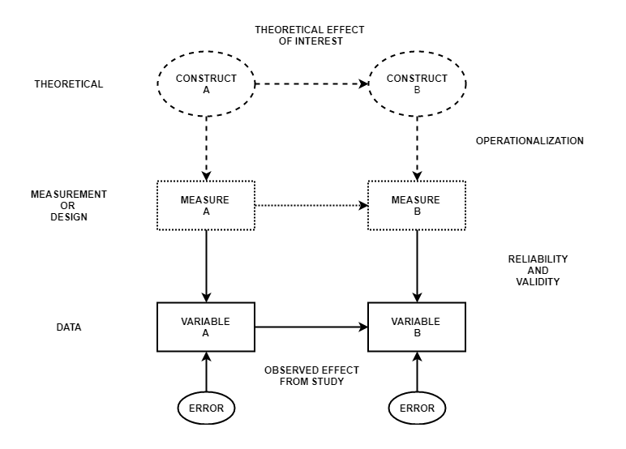
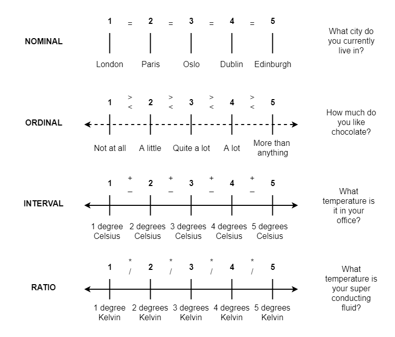

```{r setup, include=FALSE}
options(htmltools.dir.version = FALSE)
```

```{r xaringan-themer, include = FALSE}
library(xaringanthemer)
style_mono_accent(
  #base_color = "#0F4C81", # DAPR1
   base_color = "#BF1932", # DAPR2
  # base_color = "#88B04B", # DAPR3 
  # base_color = "#FCBB06", # USMR
  # base_color = "#a41ae4", # MSMR
  header_color = "#000000",
  header_font_google = google_font("Source Sans Pro"),
  header_font_weight = 400,
  text_font_google = google_font("Source Sans Pro", "400", "400i", "600", "600i"),
  code_font_google = google_font("Source Code Pro")
)
```

```{r echo=FALSE, warning=FALSE, message=FALSE}
library(tidyverse)
```

# Weeks Learning Objectives
1. Review the main concepts from introductory statistics.

2. Understand the concept of a function.

3. Be able to discuss what a statistical model is.

4. Understand the link between models and functions.

---
# Topics for today
+ What we need to review:

--
  + Types of data
      + measurement
      + data
      + levels
--
  + Principles of visualization
      + what makes a good visualization?
--
  + Hypothesis testing
      + How do we try and know stuff?


---
# IMPORTANT

**PLEASE RE-READ THIS SLIDE REGULARLY**

1. Data analysis can be tricky 

2. You are not expected to know everything after the first time you hear it.

3. Getting stuff wrong is fine

4. Ask lots of questions

???
They are important concepts we will come back to throughout. Today is just about major distinctions.

Many students believe that statistics is just another maths class. In reality, statistics is very different from mathematics.

In mathematics there tend to be well-defined rules (e.g. addition, division, integration, order of operation) and, if you know the rules, you can solve a mathematics problem to get the one correct answer.

In statistics there tend to be only **guidelines**. These guidelines are not exact, and only experience with data can help a person understand how to use tools such as histograms, box plots, and qq-plots, to get a feel for how well the data are behaving.

The only way to learn statistics is by doing it, it requires practice.

Furthermore, in statistics it is very likely that there is more than one correct approach and more than one correct solution to any problem.


---
# Measurement


```{r, echo=FALSE, out.width="50%"}

```


???
Key points
+ We have theories and ideas about constructs
+ when we do studies, we choose to measures those in a certain way
+ it is measurements that result in the variables we see in data sets, and the individual values for our participants on that data

---
# Data sets

```{r, echo=FALSE, out.width="80%"}
knitr::include_graphics("./figs/tidy-1.png")
```


???
+ reinforce the point that when we are looking at data, it is variables and values, not constructs.

---
# Data types
.pull-left[
+ *Numbers do not mean anything*

> What county do you currently reside in?

> What colour is your hair?

]

.pull-right[
+ *Numbers mean something*

> How old (in years) are you?

> How many siblings do you have?

]

---
# Levels of measurement

```{r, echo=FALSE, out.width="50%"}

```


---
# Data types & levels

.pull-left[
+ *Categorical*
    + Nominal
    + Ordinal
    + Binary (special case)
]

.pull-right[
+ *Numeric*
    + Interval or ratio
    + Continuous
    + Discrete (Count)
]

---
class: center, middle
# Time for a break

**Before watching the next video...**

Read the measurement course handout.

---
class: center, middle
# Welcome Back!

**Where we left off...**

---
# Data visualization
+ We will make extensive use of data visualization
+ Don't try to learn everything now.
+ Work through the `ggplot2` tutorial in your own time
+ Spend time thinking about all the plots we show


---
# Data Visualization

+ Important in *science*, business, journalism, etc.
+ Two key roles:

    1. Communication
    2. Analysis

+ Summary statistics never give the full *picture*:

---
# Same summary, different data

```{r, echo=FALSE, out.width="80%"}
knitr::include_graphics("./figs/SameData_DifferentGraphs.png")
```


---
# `ggplot`: Grammar of Graphics

+ Many graphing programs treat data visualization like painting picture: 
    + red circle at $x_1,y_1$, blue square at $x_2,y_2$, etc.
+ This is inefficient and very easy to make mistakes.

---

# The `ggplot` way: 

+ A graph has 3 core elements:

1. A data set
2. A set of mappings between variables in the data set and properties (*aesthetics*) of the graph
3. Layers of *geoms* to instantiate those mappings

---

# An example

+ A line plot:

```{r fig.height=4}
ggplot(Orange, aes(x=age, y=circumference, color=Tree)) + 
  geom_line()
```

---

# An example

```{r fig.height=4}
ggplot(Orange, aes(x=age, y=circumference, color=Tree)) + 
  geom_line() + 
  geom_point() # Add points
```

+ Notice that the lines and points have matching colors


---

# Refining figures
* Scales
    + Colours
    + Point shapes
    + Legends/guides
    + Etc.
* Themes
    + Axes, grid lines, tick marks and labels
    + Legend position
    + Font sizes
* Annotations: geoms that are not data

---
# What to look for in plots?
+ What does the x-axis represent?
+ What does the y-axis represent?
+ What are the scales of x and y?
+ What is the within the plot (e.g. line, dots, bars)?
+ What does that represent?

---
# An example

```{r fig.height=4}
ggplot(Orange, aes(x=age, y=circumference, color=Tree)) + 
  geom_line() + 
  geom_point() # Add points
```


---
class: center, middle
# Time for a break

**Before watching the next video...**

Spend some time looking at the plot on the previous slide

Try to answer the "What to look for in plots?" questions

---
class: center, middle
# Welcome Back!

**Where we left off...**

Reviewing the plot...

---
# Hypothesis testing

+ Structure of a Hypothesis Test

+ **Hypothesis**: a formal statement of a research question.
+ **A hypothesis test**:
  + **Test statistic**: A quantity that represents our question (e.g. difference in means)
  + **Observed test statistic**: The test statistic calculated on from our data
  + **Null distribution**: A probability distribution for different values of the tests statistic **if** the data were random.
  + **p-value**: A probability value associated with our observed test statistic taken from the null.
  + **Significance level**: A binary threshold for interpreting our $p$-value.

???
+ Hypothesis testing is tricky. In this weeks folder we have added the full lectures on hypotheses testing. 
+ strongly suggest all students review these
+ we will break this down when we discuss our first hypothesis tests relating to linear models in more detail

---
# Next tasks
+ If you feel you need a refresher on any of the topics;
  + Go to LEARN dapR2 week 1 folder
  + Click on recap material
  + Select the topic you wish to recap and work through
  + Check for the open office hours related to the topic at the end of the week for questions

+ This week:
  + Complete your lab
  + Weekly quiz - practice test 1
      + Open Monday 09:00
      + Closes Sunday 17:00


