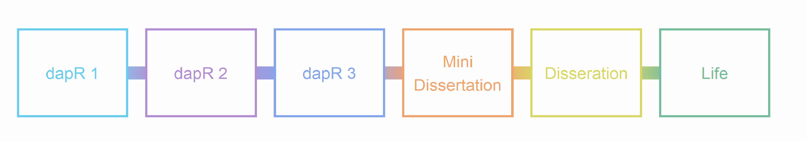

```{r setup, include=FALSE}
options(htmltools.dir.version = FALSE)
```

```{r xaringan-themer, include = FALSE}
library(xaringanthemer)
style_mono_accent(
  #  base_color = "#0F4C81", # DAPR1
   base_color = "#BF1932", # DAPR2
  # base_color = "#88B04B", # DAPR3 
  # base_color = "#FCBB06", # USMR
  # base_color = "#a41ae4", # MSMR
  header_color = "#000000",
  header_font_google = google_font("Source Sans Pro"),
  header_font_weight = 400,
  text_font_google = google_font("Source Sans Pro", "400", "400i", "600", "600i"),
  code_font_google = google_font("Source Code Pro")
)

library(tidyverse)
```


```{r welcome, echo=FALSE}
cohort <- 2019
team <- c("Tom", "Anastasia", "Emma" , "Esperanza", 
          "Carolane", "Catherine", "Abby", "Svenja",
          "Yangzi", "Diana")
lecture_hours <- 10+10+50
lab_hours <- 20+20
```


# In this intro...
+ The dapR team

--

+ dapR and your degree
  + Plus a few course details

--

+ Expectations

--

+ What each week will look like.


---
# dapR Team
+ Tom Booth (CO)
+ Alex Doumas
+ Jo King
+ Umberto Noe
+ Aja Murray
+ Wonderful tutors (lots)


---
# Where does dapR2 fit?

```{r, echo=FALSE}

```


---
# dapR 2 
+ In dapR2, we will teach you how to...

--

  + Deal with data in R, tidy it, describe it and visualize it

--

  + Run, interpret and use linear models for observational designs
  
--

  + Run, interpret and use linear models for experimental designs


---
# What is R? 
+ A very flexible, very cool, programming language for all things data.
  + It does pretty much any statistical method you can think of. (Cool? I think so)
  + But it does a lot more.

+ We will also continue to teach you Rmarkdown 
  + this is a cool way to integrate text and analysis
  + and to write reproducible documents and analyses

---
# What is R? 
+ Some examples:
  + [interactive plots](https://shiny.rstudio.com/gallery/movie-explorer.html) 
  + [interactive dashboards](https://gallery.shinyapps.io/086-bus-dashboard/) 
  + Documents with automatically include results from analysis
  + [books](https://bookdown.org/csgillespie/efficientR/)
  + [websites](https://rmarkdown.rstudio.com/)
  + Presentations (like the one you are looking at)


---
# What is R?

+ But what is best of all is it is completely free.

+ You can go and download the R-code that made everything I just showed you.

+ There is a massive R community, and a world of resources and help.


---
class: center, middle
# Pause this recording for a few minutes and explore the links

---
class: center, middle
# Welcome Back!

**Where we left off... **


---
# Where does dapR2 fit?


```{r, echo=FALSE}

```

---
# dapR 3
+ Honours level data analysis course.

--

+ Theoretical focus: some advanced models and thinking critically about statistics.

--

+ Practical focus: taking real data, in the form it comes from the tools we use to do our studies.

--

+ Then using the skills we have built up to answer questions, and report the answers in a variety of formats.


---
# Projects  
+ Then you do this for real!

--

+ Year 3 mini-dissertation is a group research project with a member of faculty.
  + Now you can apply the skills to your own project, with a group to help problem solve.

--

+ Then in year 4, you will have the real deal dissertation.
  + Well, for those of you who stay with psych.
  + A real project you can really take ownership of.

---
# Life
+ And once all that is done, it may be time to face down life.

+ But don't think you will leave these skills behind.

+ My last 3 months....

--

+ Oh and ££££££££££££££££££££££££££££££££££££££££££££££££
  + Well I can't really promise this, but data science and highly numerate jobs tend to pay pretty well!


---
# What you can expect from us
1. We will work hard to help you learn.

2. We will be open and communicate with you.

3. We will be polite, respectful and treat you like adults.


---
# What we expect of you
1. You work hard.

2. That you talk to me and the teaching team.

3. That you are polite, and respect the teaching team and your classmates.

4. Try and have fun.


---
# dapR 2: Structure
+ We are on-line, so this will look a little different to normal.

--

+ **Lectures**
  + Equivalent of ~2hr of live lecture, broken into shorter chunks
  + The chunks will be linked with tasks.

--

+ **Independent study labs**
  + Structured reading and exercises with R
  + Equivalent of ~2-3 hrs per week

--

+ **Supported by**
  + "In person" on-line office hours (4x1hr slots across week; see LEARN for times)
  + Discussion boards (monitored daily)
  + Lecturer OH (see LEARN for times)

---
# dapR 2: Structure cont.

+ **Live coding**
  + We will try and have a number of synchronous live coding examples
  + These will be run through of types of analysis
  + Sometimes reproducing papers
  + Will be recorded, so if there are any issues with live sessions, they are accessible.


--

+ **Reading**
  + All reading is from free to access sources.
  + You do not need to buy a book and should be able to access everything electronically.


???
+ Requires you to work steadily and consistently across the year. 
+ It builds, and it is hard to cram.
+ To help you build this study skills, course has a specific assessment structure.


---
# dapR 2: Assessment 
+ **Weekly quizzes** (10%)
  + 20 quizzes in total 
  + Quizzes 1 and 2 are practices.
  + The rest comprise your grade.
  + Mark is the average of your best 14/18 scores.

--

+ **Coursework report** (2x 45%%)
  + One per semester
  + Provided a dataset and some questions
  + Task is to construct models to answer the questions, describe them, run them, report the results.
  
--

+ The reports will have some components that are difficult, and will require independent work.

???
Key point to make is the little and often principle


---
# A brief word on engagement
+ It is going to be a different year for everyone

--

+ We are very keen to make sure everyone succeeds. 

--

+ To do that, we need to know when people are struggling. 

--

+ We will keep an eye on this in a number of ways:
  + Presence in OH
  + Engagement with material (watching recordings, discussion boards etc.)
  + Weekly quiz performance.

---
class: center, middle's
# And that is it for this intro!

However, please watch the second introductory video which will help you navigate LEARN