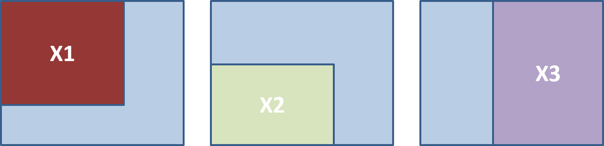
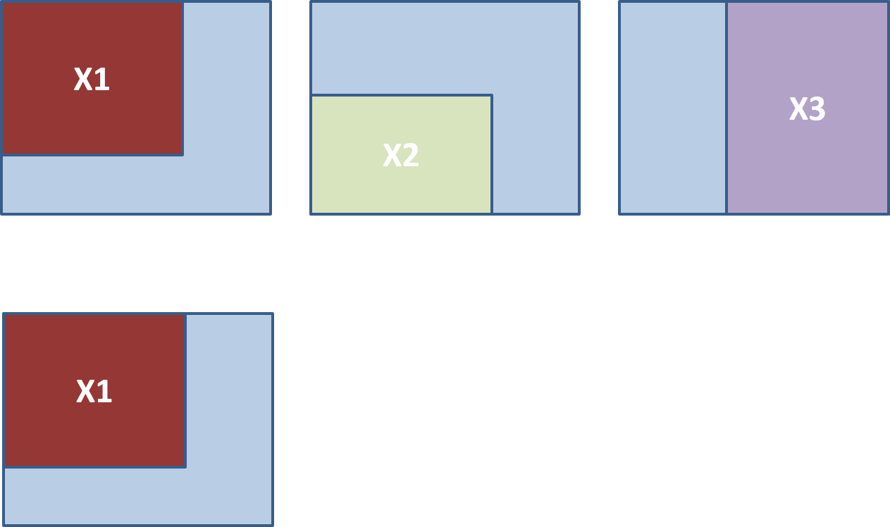
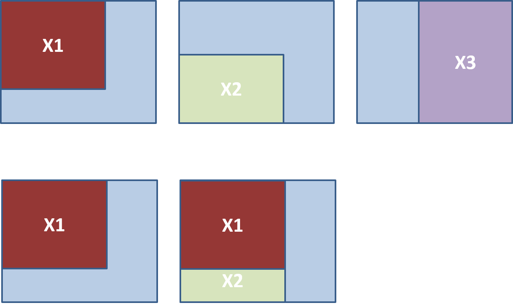
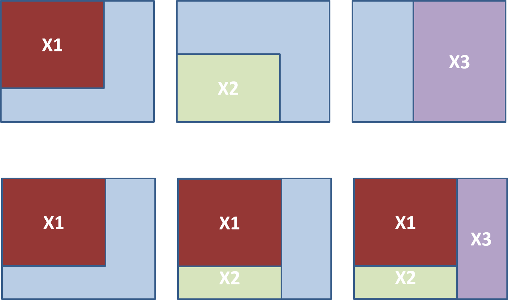
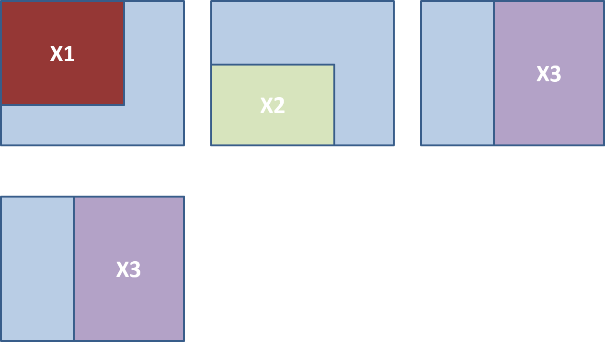
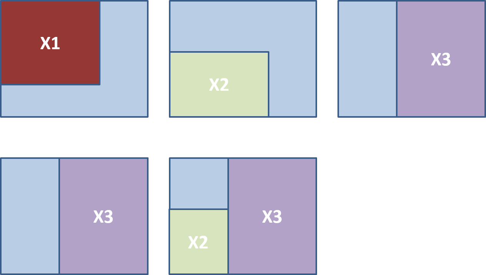
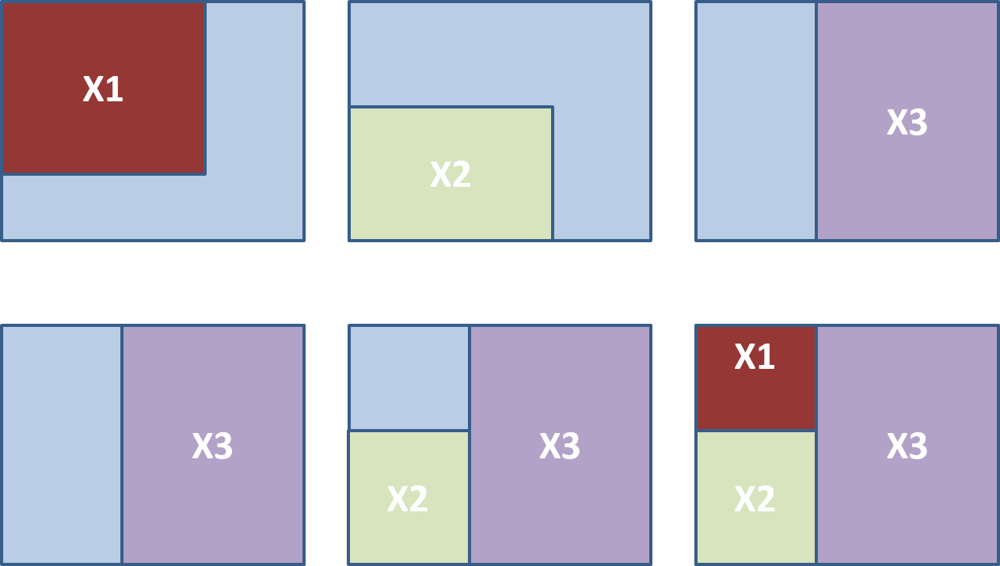
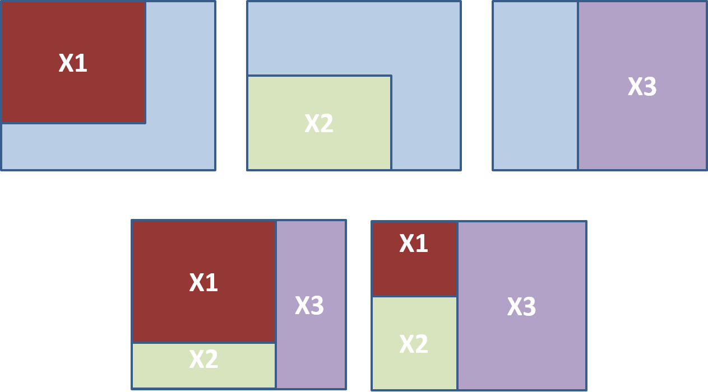
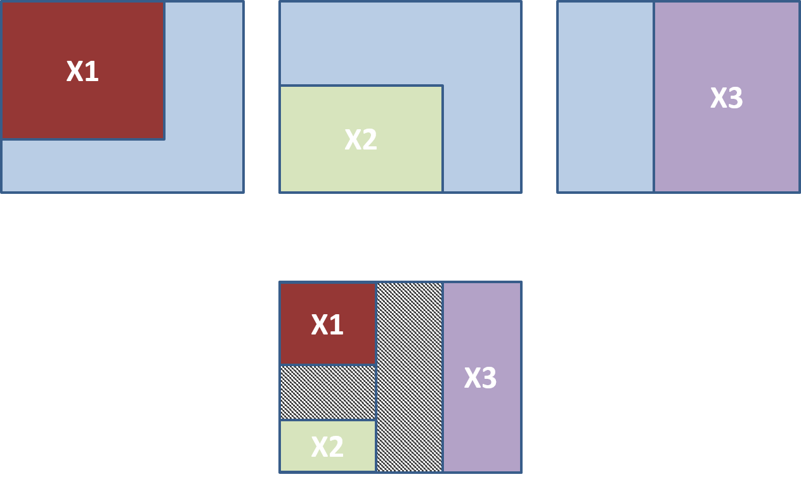
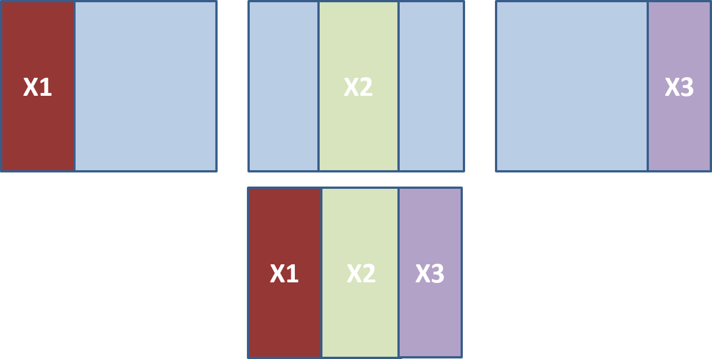

```{r setup, include=FALSE}
options(htmltools.dir.version = FALSE)
```

```{r xaringan-themer, include = FALSE}
library(xaringanthemer)
style_mono_accent(
  #base_color = "#0F4C81", # DAPR1
   base_color = "#BF1932", # DAPR2
  # base_color = "#88B04B", # DAPR3 
  # base_color = "#FCBB06", # USMR
  # base_color = "#a41ae4", # MSMR
  header_color = "#000000",
  header_font_google = google_font("Source Sans Pro"),
  header_font_weight = 400,
  text_font_google = google_font("Source Sans Pro", "400", "400i", "600", "600i"),
  code_font_google = google_font("Source Code Pro")
)
```

```{r, echo=FALSE, message=FALSE, warning=FALSE}
library(tidyverse)
library(kableExtra)
library(car)
```

# Topics for today
- Types of sums of squares. 
- Examples of partitioning variance with sums of squares.

---
# Types of sums of squares
- Recall that in a single predictor model, $\beta_1$ is the slope of the regression line, or the change in $y$ due to a unit change in $x$. 
- In ANOVA, a main-effect of IV1 indicates a change in the DV for changes in IV1, when each other IVj ( $i \neq j$ ) are held constant 
- But what does all that mean?
  - It could mean: each IVi main effect tells you the contribution of $x_i$ beyond the contribution of the other predictors already considered. 
  - It could mean: each IVi main effect tells you the contribution of $x_i$ above and beyond the contribution of all the other predictors? 
  - Depends on how you calculate your SS... 

---
# Sums of Squares
+ We have been talking a lot about sums of squares calculations.
  + Something we have held off discussing (until now) is that there are different types.

+ **Type I**: Sequential sums of squares
  + Effect of X on Y, holding all previous X constant
  + Order of variables into the model matters

+ **Type III**: Simultaneous sums of squares
  + Effect on X on Y holding all X constant
  + Order of variables into the model does not matter

+ Note: There are also type II sums of squares


---
# Example for SS
+ Let’s say we had three predictors of aggression:
  + Age ( $x_1$ )
  + Gender ( $x_2$ )
  + Anger-proneness ( $x_3$ )

+ In type I sums of squares:
  + The effect of age would be evaluated holding no other variables constant
  + The effect of gender would be evaluated holding age constant
  + The effect of anger-proneness would be evaluated holding age and gender constant

+ In type III sums of squares:
  + The effects of age, gender and anger-proneness would all be evaluated holding every other IV constant


---
# SS formally

$$y = \beta_0 + \beta_1 x_1 + \beta_2 x_2 + \beta_3 x_3 + \epsilon$$

.pull-left[
**Type I**

$$SS(\beta_1)$$
$$SS(\beta_2 | \beta_1)$$
$$SS(\beta_3 | \beta_1, \beta_2)$$

]

.pull-right[

**Type III**

$$SS(\beta_1 | \beta_2, \beta_3)$$
$$SS(\beta_2 | \beta_1, \beta_3)$$
$$SS(\beta_3 | \beta_1, \beta_2)$$
]

---
# SS Type I (sequential)

```{r, echo=FALSE, out.width="70%", fig.align='center'}

```

---
# SS Type I (sequential) x1

```{r, echo=FALSE, out.width="70%", fig.align='center'}

```

---
# SS Type I (sequential) x1

```{r, echo=FALSE, out.width="70%", fig.align='center'}

```

---
# SS Type I (sequential) x1

```{r, echo=FALSE, out.width="70%", fig.align='center'}

```

---
# SS Type I (sequential) x3

```{r, echo=FALSE, out.width="70%", fig.align='center'}

```

---
# SS Type I (sequential) x3

```{r, echo=FALSE, out.width="70%", fig.align='center'}

```

---
# SS Type I (sequential) x3

```{r, echo=FALSE, out.width="70%", fig.align='center'}

```

---
# SS Type I (sequential)
+ Comparison

```{r, echo=FALSE, out.width="70%", fig.align='center'}

```

---
# SS Type III (simultaneous)

```{r, echo=FALSE, out.width="70%", fig.align='center'}

```


---
# Equivalent SS

+ If **all predictors are uncorrelated** Type I and Type III sums of squares provide the same partition

```{r, echo=FALSE, out.width="70%", fig.align='center'}

```

---
# Types of sums of squares: Summary
- Ways to calculate the effects of each predictor. 
  - Type I SS: calculate the improvement to the model produced by each predictor considered in turn. 
  - Type III SS: calculate the improvement to the model produced by each predictor, when taking all of the other predictors into account simultaneously. 

---
# SS in R
+ `lm` uses Type III sums of squares

+ `anova` uses Type I sums of squares

+ `ezANOVA` (and some other packages) you can specify

---
# Summary
- There are different ways to calculate sums of squares. 
- Most packages will use Type I or Type III sums of squares. 
- The main point to consider is whether the sums of squares calculation is sequential or simultaneous. 

